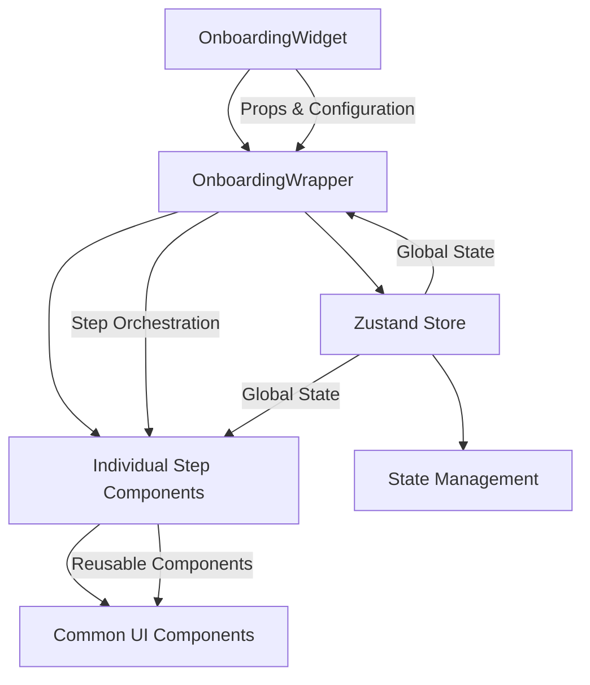
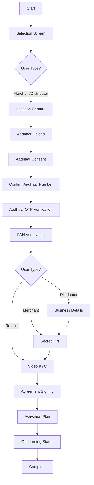
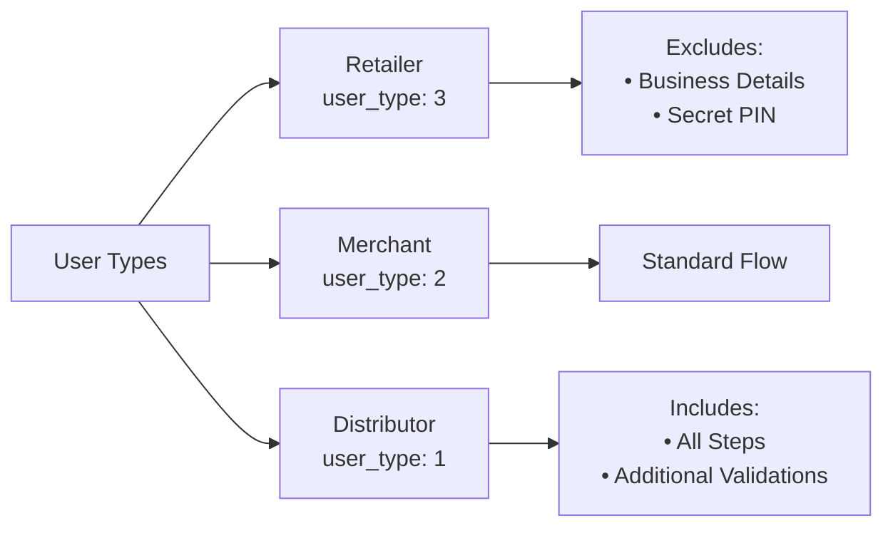

# Onboarding-as-a-Service (OaaS) Widget

[](https://www.npmjs.com/package/@ekoindia/oaas-widget)
[](https://github.com/ekoindia/oaas-widget/blob/main/LICENSE)
[](https://www.typescriptlang.org/)

A comprehensive React-based widget for digital onboarding processes, providing step-by-step user verification including KYC, document verification, location capture, and compliance checks.

## 🚀 Quick Start

### Installation

```bash
npm install @ekoindia/oaas-widget
```

### Basic Usage

```typescript
import { OnboardingWidget } from '@ekoindia/oaas-widget';

const MyApp = () => {
    const handleSubmit = (stepData) => {
        console.log('Step completed:', stepData);
        // Handle step submission to your backend
    };

    const stepsData = [
        {
            id: 2,
            name: 'selection',
            label: 'Select Your Role',
            primaryCTAText: 'Continue',
            description: 'Choose your business type',
            isSkipable: false,
            isRequired: true,
            isVisible: true,
            stepStatus: 1,
            form_data: {
                /* step-specific data */
            }
        }
        // ... other steps
    ];

    return (
        <OnboardingWidget
            appName="My App"
            orgName="My Organization"
            userData={{ userDetails: { user_type: 1 } }}
            stepsData={stepsData}
            handleSubmit={handleSubmit}
            primaryColor="#007bff"
            shopTypes={[]}
            stateTypes={[]}
            bankList={[]}
        />
    );
};
```

## 📋 Table of Contents

1. [Architecture Overview](#-architecture-overview)
2. [User Flow](#-user-flow)
3. [Available Steps](#-available-steps)
4. [Integration Guide](#-integration-guide)
5. [API Integration](#-api-integration)
6. [Configuration](#-configuration)
7. [Development Setup](#-development-setup)
8. [Project Structure](#-project-structure)
9. [Build & Deployment](#-build--deployment)

## 🏗️ Architecture Overview

The widget follows a modular architecture with the following key layers:



### Core Components

| Component             | Location                                  | Purpose                                           |
| --------------------- | ----------------------------------------- | ------------------------------------------------- |
| **OnboardingWidget**  | `src/components/OnboardingWidget/`        | Main container, handles configuration and theming |
| **OnboardingWrapper** | `src/components/Steps/OnboardingWrapper/` | Step orchestrator, manages flow and navigation    |
| **Individual Steps**  | `src/components/Steps/*/`                 | Step-specific implementations                     |
| **Common Components** | `src/components/Common/`                  | Reusable UI components                            |
| **Zustand Store**     | `src/store/zustand.tsx`                   | Global state management                           |

### Component Logic Flow

#### OnboardingWidget (Main Entry Point)

The `OnboardingWidget` component serves as the main entry point and handles:

1. **Theme Configuration**: Dynamically sets CSS custom properties for `primaryColor` and `accentColor`
2. **Initial Step Detection**: Automatically finds the first visible step with a role that's not completed (stepStatus !== 3)
3. **Data Preparation**: Adds default select options to `shopTypes`, `stateTypes`, and `bankList` arrays
4. **Sidebar State Management**: Manages the sidebar toggle state for mobile/responsive views

**Key Logic:**

```typescript
// Initial step selection logic (simplified)
const initialStep = stepsData?.find((step) => step.role && step.isVisible && step.stepStatus !== 3);
const initialStepId = initialStep?.id ?? stepsData[0]?.id;
```

#### OnboardingWrapper (Step Orchestrator)

The `OnboardingWrapper` component is responsible for:

1. **Step Rendering**: Uses a centralized `renderStep()` function with a switch-case statement based on `STEP_IDS` constants
2. **Step Data Lookup**: Finds the current step data from `stepsData` array using `currentOnboardingStepId`
3. **Conditional Component Rendering**: Renders different business components based on user type (e.g., Distributor vs Merchant)
4. **Layout Management**: Handles responsive layout with sidebar visibility control

**Key Features:**

-   **Simplified Switch Statement**: Uses `STEP_IDS` constants from `src/utils/constants.ts` for readable step identification
-   **User Type-Specific Logic**: Conditionally renders different components (e.g., `Business` vs `BusinessMerchant`) based on `userData.userDetails.user_type`
-   **Error Handling**: Returns a fallback message if step data is not found
-   **Responsive Design**: Sidebar is hidden on mobile and shown on larger screens

## 🔄 User Flow

### Complete Onboarding Flow



### User Type Variations



## 📝 Available Steps

### Core Verification Steps

| Step ID | Constant Name                  | Component                        | Purpose                  | Required | User Type Dependent    |
| ------- | ------------------------------ | -------------------------------- | ------------------------ | -------- | ---------------------- |
| 1       | `WELCOME`                      | `Welcome`                        | Welcome screen           | ⚪       | All                    |
| 2       | `SELECTION_SCREEN`             | Not rendered in wrapper          | Role selection           | ✅       | All                    |
| 3       | `LOCATION_CAPTURE`             | `LocationCapture`                | GPS coordinates          | ✅       | All                    |
| 4       | `AADHAAR_VERIFICATION`         | `AdharVerifiction`               | Aadhaar upload           | ✅       | All                    |
| 5       | `AADHAAR_CONSENT`              | `AadhaarConsent`                 | Aadhaar consent          | ✅       | All                    |
| 6       | `CONFIRM_AADHAAR_NUMBER`       | `ConfirmAadhaarNumber`           | Confirm Aadhaar number   | ✅       | All                    |
| 7       | `AADHAAR_NUMBER_OTP_VERIFY`    | `AadhaarNumberOtpVerify`         | Aadhaar OTP verification | ✅       | All                    |
| 8       | `PAN_VERIFICATION`             | `PanVerification`                | PAN card verification    | ✅       | All                    |
| 9       | `BUSINESS`                     | `Business` or `BusinessMerchant` | Business information     | ✅       | Distributors/Merchants |
| 10      | `SECRET_PIN`                   | `SecretPin`                      | Security PIN setup       | ✅       | Distributors/Merchants |
| 11      | `VIDEO_KYC`                    | `VideoKYC`                       | Live video verification  | ✅       | All                    |
| 12      | `SIGN_AGREEMENT`               | `SignAgreement`                  | Digital signature        | ✅       | All                    |
| 13      | `ACTIVATION_PLAN`              | `ActivationPlan`                 | Service plan selection   | ✅       | All                    |
| 14      | `ONBOARDING_STATUS`            | `OnboardingStatus`               | Completion status        | ✅       | All                    |
| 15      | `PAN_AADHAAR_MATCH`            | `PanAdharMatch`                  | PAN-Aadhaar linkage      | ✅       | All                    |
| 16      | `PAN_VERIFICATION_DISTRIBUTOR` | `PanVerificationDistributor`     | Distributor PAN          | ✅       | Distributors           |
| 20      | `DIGILOCKER_REDIRECTION`       | `DigilockerRedirection`          | Digilocker integration   | ⚪       | Optional               |
| 25      | `ADD_BANK_ACCOUNT`             | `BankAccount`                    | Bank account details     | ⚪       | Optional               |

### Step-Specific Logic

#### Business Step (Step 9)

The Business step renders different components based on user type:

-   **Distributor** (`user_type === 1`): Renders `Business` component with detailed business information
-   **Merchant** (`user_type !== 1`): Renders `BusinessMerchant` component with simplified merchant details

### Step Status Values

The widget uses standardized status codes defined in `STEP_STATUS` constants:

-   **0 (NOT_STARTED)**: Step not yet started
-   **1 (IN_PROGRESS)**: Currently active step
-   **2 (COMPLETED)**: Step was skipped or bypassed
-   **3 (FAILED)**: Step successfully completed

**Note:** The initial step is automatically selected as the first visible step with a role that has `stepStatus !== 3` (not completed).

## 🔧 Integration Guide

### Props Configuration

```typescript
interface OnboardingWidgetProps {
    // Required props
    userData: any; // User information including userDetails with user_type
    stepsData: StepDataType[]; // Step configuration array
    handleSubmit: (data: any) => void; // Step completion callback

    // Optional props
    appName?: string; // Application name
    orgName?: string; // Organization name
    primaryColor?: string; // Theme primary color (default: #007bff)
    accentColor?: string; // Theme accent color
    shopTypes?: Array<any>; // Available shop types for selection
    stateTypes?: Array<any>; // Available states for location
    bankList?: BankListType; // Available banks for account verification
    stepResponse?: any; // API response data for step validation
    handleStepCallBack?: any; // Step-specific callback handler
    esignStatus?: number; // E-signature completion status
    digilockerData?: any; // Digilocker integration data
}
```

### Step Data Structure

```typescript
type StepDataType = {
    id: number; // Unique step identifier (use STEP_IDS constants)
    name: string; // Step name/slug (e.g., 'location', 'aadhaar_consent')
    label: string; // Display title shown in UI
    primaryCTAText: string; // Button text (e.g., 'Continue', 'Submit')
    description: string; // Step description/instructions
    isSkipable: boolean; // Whether the step can be skipped
    isRequired: boolean; // Whether the step is required for completion
    isVisible: boolean; // Whether the step should be shown in the flow
    stepStatus: 0 | 1 | 2 | 3; // 0: Not Started, 1: In Progress, 2: Skipped, 3: Completed
    role?: number; // Associated user role (1: Distributor, 2: Merchant, 3: Retailer)
    form_data: any; // Step-specific data and form values
    success_message?: string; // Message displayed on successful completion
};
```

### Step ID Constants

The widget uses centralized constants from `src/utils/constants.ts` for step identification:

```typescript
export const STEP_IDS = {
    WELCOME: 1,
    SELECTION_SCREEN: 2,
    LOCATION_CAPTURE: 3,
    AADHAAR_VERIFICATION: 4,
    AADHAAR_CONSENT: 5,
    CONFIRM_AADHAAR_NUMBER: 6,
    AADHAAR_NUMBER_OTP_VERIFY: 7,
    PAN_VERIFICATION: 8,
    BUSINESS: 9,
    SECRET_PIN: 10,
    VIDEO_KYC: 11,
    SIGN_AGREEMENT: 12,
    ACTIVATION_PLAN: 13,
    ONBOARDING_STATUS: 14,
    PAN_AADHAAR_MATCH: 15,
    PAN_VERIFICATION_DISTRIBUTOR: 16,
    DIGILOCKER_REDIRECTION: 20,
    ADD_BANK_ACCOUNT: 25
};
```

## 🔌 API Integration

### Step Callbacks

The `handleStepCallBack` function is used for steps that require real-time API interactions (e.g., OTP verification, Digilocker URL generation). The widget passes the callback to specific step
components that need it.

**Steps that use handleStepCallBack:**

-   Location Capture (Step 3)
-   Aadhaar OTP Verification (Step 7)
-   Secret PIN (Step 10)
-   Sign Agreement/E-sign (Step 12)
-   Activation Plan (Step 13)
-   Digilocker Redirection (Step 20)

```typescript
const handleStepCallBack = ({ type, method, data }) => {
    switch (`${type}-${method}`) {
        case '20-getDigilockerUrl':
            // Get Digilocker redirection URL
            return fetch('/api/digilocker/generate-url', {
                method: 'POST',
                body: JSON.stringify({ userId, sessionId }),
                headers: { 'Content-Type': 'application/json' }
            }).then((response) => response.json());

        case '7-verifyOtp':
            // Verify Aadhaar OTP
            return fetch('/api/aadhaar/verify-otp', {
                method: 'POST',
                body: JSON.stringify(data),
                headers: { 'Content-Type': 'application/json' }
            }).then((response) => response.json());

        case '12-esignDocument':
            // Handle e-signature
            return fetch('/api/esign/initiate', {
                method: 'POST',
                body: JSON.stringify(data),
                headers: { 'Content-Type': 'application/json' }
            }).then((response) => response.json());
    }
};
```

### Step Submission

```typescript
const handleSubmit = async (stepData) => {
    try {
        const response = await fetch('/api/onboarding/step', {
            method: 'POST',
            headers: { 'Content-Type': 'application/json' },
            body: JSON.stringify({
                stepId: stepData.id,
                formData: stepData.form_data,
                status: stepData.stepStatus
            })
        });

        const result = await response.json();

        if (result.status === 0) {
            // Success - widget will auto-progress
            setStepResponse(result);
        } else {
            // Handle validation errors
            setStepResponse({
                status: 1,
                invalid_params: result.errors
            });
        }
    } catch (error) {
        console.error('Step submission failed:', error);
    }
};
```

## ⚙️ Configuration

### Environment Setup

Create a `.env` file in your project root:

```bash
# API Configuration
REACT_APP_API_BASE_URL=https://your-api-base-url.com
REACT_APP_ENVIRONMENT=development

# Feature Flags
REACT_APP_ENABLE_DIGILOCKER=true
REACT_APP_ENABLE_VIDEO_KYC=true

# Third-party Integrations
REACT_APP_ESIGN_PROVIDER_URL=https://esign-provider.com
```

### Theming

The widget supports custom theming through CSS custom properties that are set dynamically:

```typescript
// Custom theme configuration
<OnboardingWidget
    primaryColor="#ff6b35" // Sets CSS variable --color-primary
    accentColor="#00a8cc" // Sets CSS variable --color-accent
    appName="MyApp"
    orgName="MyOrg"
    // ... other props
/>
```

The widget automatically sets these CSS custom properties on the document root, which are used throughout the Tailwind configuration.

### Step Visibility Control

```typescript
const stepsData = [
    {
        id: 9,
        name: 'business',
        // ... other properties
        isVisible: userData.userType !== 3, // Hide for retailers
        role: 1 // Only for distributors
    }
];
```

## 🛠️ Development Setup

### Prerequisites

-   Node.js (v16+)
-   React (v18+)
-   TypeScript (v4.9+)

### Local Development

To include the package in your local project for testing, you can use the npm link command. This will create a symlink to the package in your project's node_modules directory, allowing you to import
it as a local dependency.

#### To test the package locally:

1. Create build using `npm run build` to create dist folder which will serve target projects.
2. Run the `npm link` command in this project's root directory to create a symlink.
3. Run the `npm link @ekoindia/oaas-widget` command in your target project's root directory to link this package.
    1. A folder called `@ekoindia` will be created in your target project's node_modules directory with a symlink to this package. You may delete that folder to remove the symlink.
4. Import the package in your project and use it as a local dependency.
5. Make changes in this package and rebuild using `npm run build` to see the changes reflected in your target project.
6. When done testing,
    - Run `npm unlink @ekoindia/oaas-widget` in your target project to remove the symlink
    - Run `npm unlink` in this package to remove the global link
    - Also, delete the `@ekoindia` folder from your target project's node_modules directory if it still exists
    - Then, reinstall the package from npm if needed: `npm install @ekoindia/oaas-widget`.

## 📁 Project Structure

```
oaas-widget/
├── 📁 src/                          # Source code
│   ├── 📁 assets/                   # Static assets
│   │   ├── 📁 icons/               # SVG and PNG icons
│   │   ├── CloseIcon.tsx           # Close icon component
│   │   └── DropdownIcon.tsx        # Dropdown icon component
│   │
│   ├── 📁 components/              # React components
│   │   ├── 📁 Common/              # Reusable components
│   │   │   ├── 📁 Camera/          # Camera-related components
│   │   │   ├── 📁 Header/          # Header components
│   │   │   ├── 📁 Sidebar/         # Sidebar components
│   │   │   ├── 📁 CamDropzone/     # Camera dropzone
│   │   │   ├── Alert.tsx           # Alert component
│   │   │   ├── ButtonGlobal.tsx    # Global button component
│   │   │   ├── InputGlobal.tsx     # Global input component
│   │   │   ├── Modal.tsx           # Modal component
│   │   │   ├── Spinner.tsx         # Loading spinner
│   │   │   └── ...                 # Other common components
│   │   │
│   │   ├── 📁 CustomHooks/         # Custom React hooks
│   │   │   └── UseGeoLocation.tsx  # Geolocation hook
│   │   │
│   │   ├── 📁 OnboardingWidget/    # Main widget component
│   │   │   ├── OnboardingWidget.tsx
│   │   │   └── index.ts
│   │   │
│   │   └── 📁 Steps/               # Step components
│   │       ├── 📁 AadharSteps/     # Aadhaar verification steps
│   │       ├── 📁 ActivationPlan/  # Activation plan selection
│   │       ├── 📁 Agreement/       # Agreement signing
│   │       ├── 📁 Business/        # Business details
│   │       ├── 📁 DigilockerRedirection/ # Digilocker integration
│   │       ├── 📁 KYC/            # Video KYC
│   │       ├── 📁 Location/        # Location capture
│   │       ├── 📁 OnBoardingStatus/ # Onboarding status
│   │       ├── 📁 OnboardingWrapper/ # Step orchestrator
│   │       ├── 📁 PanSteps/        # PAN verification steps
│   │       ├── 📁 PIN/             # Secret PIN setup
│   │       ├── 📁 SelectionScreen/ # Role selection
│   │       ├── 📁 SupersetComponent/ # Superset integration
│   │       ├── 📁 Welcome/         # Welcome screen
│   │       └── index.ts
│   │
│   ├── 📁 scripts/                 # External scripts
│   │   └── leegalityv5.min.js     # Leegality integration
│   │
│   ├── 📁 store/                   # State management
│   │   └── zustand.tsx            # Zustand store configuration
│   │
│   ├── 📁 types/                   # TypeScript type definitions
│   │   └── index.d.ts             # Global type definitions
│   │
│   ├── 📁 utils/                   # Utility functions
│   │   ├── 📁 data/               # Data configurations
│   │   │   └── stepsData.ts       # Step data types
│   │   └── 📁 globalInterfaces/   # Global interfaces
│   │       └── stepsInterface.ts  # Step interface definitions
│   │
│   ├── index.css                  # Global styles
│   └── index.ts                   # Main entry point
│
├── 📁 types/                       # Generated TypeScript declarations
├── 📁 dist/                        # Built package output
├── package.json                    # Package configuration
├── tsconfig.json                   # TypeScript configuration
├── tailwind.config.js              # Tailwind CSS configuration
├── postcss.config.js               # PostCSS configuration
├── rollup.config.js                # Rollup build configuration
└── README.md                       # This documentation
```

### Key Directories Explained

| Directory                | Purpose                                                           |
| ------------------------ | ----------------------------------------------------------------- |
| `src/components/Steps/`  | Contains all step-specific components for the onboarding flow     |
| `src/components/Common/` | Reusable UI components used across different steps                |
| `src/store/`             | Zustand-based state management for global application state       |
| `src/utils/`             | Utility functions, data configurations, and interface definitions |
| `src/assets/`            | Static assets including icons and images                          |
| `types/`                 | Generated TypeScript declaration files for the built package      |

## 🚀 Build & Deployment

### Build Configuration

The project uses **Rollup** for efficient bundling with the following features:

-   **Tree Shaking**: Removes unused code for smaller bundle sizes
-   **ES Module Support**: Native ES module compatibility
-   **Multiple Output Formats**: CommonJS (CJS) and ES Module (ESM) builds
-   **TypeScript Support**: Full TypeScript compilation and declaration generation
-   **CSS Processing**: PostCSS and Tailwind CSS integration with inline injection
-   **Image Processing**: Optimized asset bundling

### Build Scripts

```bash
# Production build
npm run build

# Generates:
# ├── dist/
# │   ├── index.js          # CommonJS bundle
# │   ├── index.esm.js      # ES module bundle
# │   ├── index.d.ts        # TypeScript declarations
# │   └── (CSS inlined in JS bundles)

# Check for outdated dependencies
npm run check-updates
```

### Publishing to NPM

1. One-time setup:
    - Ensure you have an npm account with access to the `@ekoindia` scope
    - Configure 2FA (Two-Factor Authentication) for your npm account
    - Add your npm credentials using `npm adduser` (app.admin account)
        - Enter username, email and password
        - Enter OTP sent to app.admin's email
2. Increment the package version in `package.json` file (line #3)
3. Build the package: `npm run build`
4. Publish the package: `npm run publish-try`
    - Note: this command uses `|| true` to prevent CI/CD failures if publish fails

**Note**: The package is published under the `@ekoindia` scope with public access.

### Configuration Files

#### TypeScript Configuration (`tsconfig.json`)

```json
{
    "compilerOptions": {
        "target": "ES6",
        "lib": ["ES2018", "DOM"],
        "jsx": "react",
        "module": "ESNext",
        "declaration": true,
        "declarationDir": "types",
        "outDir": "dist/esm",
        "strict": true,
        "moduleResolution": "node",
        "allowSyntheticDefaultImports": true,
        "esModuleInterop": true,
        "skipLibCheck": true
    },
    "include": ["src/**/*"],
    "exclude": ["node_modules", "dist"]
}
```

#### Rollup Configuration

-   **Input**: `src/index.ts`
-   **Output**: Multiple formats (CommonJS, ESM)
-   **Plugins**:
    -   TypeScript with declaration generation
    -   PostCSS with Tailwind CSS (inline injection)
    -   Image optimization
    -   Peer dependencies externalization
-   **External**: React, React-DOM (peer dependencies)

#### Tailwind CSS Configuration

```javascript
module.exports = {
    content: ['src/**/*.{ts,tsx}'],
    theme: {
        extend: {
            colors: {
                primary: 'var(--color-primary, #007bff)'
                // ... custom color palette
            },
            boxShadow: {
                xl: '0 20px 25px -5px rgba(0, 0, 0, 0.1)'
                // ... custom shadows
            }
        },
        container: {
            center: true,
            padding: {
                DEFAULT: '1rem',
                sm: '2rem',
                lg: '4rem',
                xl: '5rem',
                '2xl': '6rem'
            }
        }
    }
};
```

## 🧪 Testing & Quality

### Testing Framework

The project includes testing infrastructure with:

-   **Jest**: Unit and integration testing framework
-   **React Testing Library**: Component testing utilities
-   **TypeScript**: Static type checking for compile-time safety

```bash
# Run tests
npm test

# Run tests with coverage report
npm run test-coverage
```

### Storybook Integration

Interactive component development and documentation:

```bash
# Start Storybook development server (port 6006)
npm run storybook

# Build Storybook static site
npm run build-storybook

# Run Chromatic visual regression testing
npm run chromatic
```

**Note**: The project uses Storybook v6.5.15 with Webpack 4 builder for component development and testing.

## 🔧 Advanced Features

### State Management with Zustand

The widget uses Zustand (v4.3.6) for lightweight, performant state management:

```typescript
// Global state structure
interface OnboardingState {
    // Step Management
    steps: StepDataType[];
    currentStep: number;

    // UI State
    fetchData: boolean;
    sideBarToggle: boolean;

    // Media & Camera
    image: any | null;
    cameraType: string;
    cameraStatus: boolean;

    // Verification Status
    panStatus: number;
    esignStatus: number;

    // Actions
    setCurrentStep: (step: number) => void;
    setStepsData: (data: StepDataType) => void;
    setSideBarToggle: (toggle: boolean) => void;
    setImage: (image: any) => void;
    // ... other actions
}
```

State is managed centrally in `src/store/zustand.tsx` and can be accessed from any component using the Zustand hooks.

### Custom Hooks

#### useGeoLocation

Located in `src/components/CustomHooks/UseGeoLocation.tsx`, this hook provides geolocation functionality:

```typescript
const { location, error, loading } = useGeoLocation();

// Returns:
// - location: { latitude: number, longitude: number } | null
// - error: string | null
// - loading: boolean
```

This hook is used by the Location step component to capture user coordinates.

### Error Handling

```typescript
const handleSubmit = async (stepData) => {
    try {
        const response = await apiCall('/onboarding/step', stepData);

        if (response.status === 0) {
            // Success
            proceedToNextStep(response);
        } else {
            // Validation errors
            showErrors(response.invalid_params);
        }
    } catch (error) {
        // Network/system errors
        showErrorMessage('Something went wrong. Please try again.');
    }
};
```

## 🌐 Browser Support

| Browser | Version |
| ------- | ------- |
| Chrome  | ≥ 60    |
| Firefox | ≥ 60    |
| Safari  | ≥ 12    |
| Edge    | ≥ 79    |

## 📱 Mobile Support

-   **Responsive Design**: Mobile-first approach
-   **Touch Interactions**: Optimized for touch devices
-   **Camera Access**: Native camera integration
-   **Geolocation**: GPS coordinate capture
-   **Progressive Web App**: PWA-ready

## 🔒 Security Features

-   **HTTPS Required**: For camera and location access
-   **Data Encryption**: Secure data transmission
-   **Input Validation**: Client and server-side validation
-   **CSP Headers**: Content Security Policy support
-   **GDPR Compliance**: Privacy regulation compliance

## 🚨 Troubleshooting

### Common Issues

#### Camera Not Working

```bash
# Check browser permissions
# Ensure HTTPS is enabled
# Verify camera access in browser settings
```

#### Location Not Captured

```bash
# Check geolocation permissions
# Ensure HTTPS is enabled
# Verify location services are enabled
```

#### Step Not Progressing

```bash
# Check stepResponse prop format
# Verify API response structure
# Check browser console for errors
```

#### Build Errors

```bash
# Clear node_modules and reinstall
rm -rf node_modules package-lock.json
npm install

# Clear build cache
rm -rf dist
npm run build
```

## � Dependencies

### Core Dependencies

-   **React 18.2+**: UI framework (peer dependency)
-   **Zustand 4.3.6**: State management
-   **Formik 2.2.9**: Form handling
-   **React Hook Form 7.45.4**: Alternative form library
-   **Yup 1.1.1**: Schema validation
-   **React Webcam 7.0.1**: Camera integration
-   **Tailwind CSS 3.2.7**: Utility-first CSS framework
-   **Tailwind Merge 1.14.0**: Tailwind class merging utility

### Development Dependencies

-   **TypeScript 4.9.4**: Type safety
-   **Rollup 3.14.0**: Module bundler
-   **PostCSS 8.4.25**: CSS processing
-   **Jest 29.4.1**: Testing framework
-   **Storybook 6.5.15**: Component development

## 📞 Support & Resources

-   **Repository**: [github.com/ekoindia/oaas-widget](https://github.com/ekoindia/oaas-widget)
-   **NPM Package**: [@ekoindia/oaas-widget](https://www.npmjs.com/package/@ekoindia/oaas-widget)
-   **Current Version**: 4.3.0
-   **License**: MIT
-   **Author**: jalaj goyal

## 🤝 Contributing

We welcome contributions to improve the OaaS Widget! Here's how you can contribute:

1. **Fork the repository** from [github.com/ekoindia/oaas-widget](https://github.com/ekoindia/oaas-widget)
2. **Create a feature branch**: `git checkout -b feat/my-new-feature`
3. **Make your changes** with clear, descriptive commits
4. **Add tests** for new features or bug fixes
5. **Run the test suite**: `npm test`
6. **Build the package**: `npm run build`
7. **Submit a pull request** with a clear description of changes

### Coding Standards

-   Follow TypeScript best practices
-   Use functional components with hooks
-   Maintain consistent code formatting
-   Add JSDoc comments for complex functions
-   Keep components small and focused

### Branch Naming Convention

-   `feat/`: New features
-   `fix/`: Bug fixes
-   `docs/`: Documentation updates
-   `refactor/`: Code refactoring
-   `test/`: Test additions or updates

---

## 📝 Adding a New Step

The widget is designed to be modular, allowing developers to easily add new steps to the onboarding flow. Here’s a step-by-step guide on how to add a new custom step:

### 1. Create the Step Component

First, create a new directory for your step inside `src/components/Steps/`. For example, to add a "CustomStep":

-   Create a folder: `src/components/Steps/CustomStep/`
-   Create the component file: `src/components/Steps/CustomStep/CustomStep.tsx`

The component will receive `step` data and other props from the `OnboardingWrapper`.

```tsx
// src/components/Steps/CustomStep/CustomStep.tsx
import React from 'react';
import { StepProps } from '../../../utils/globalInterfaces/stepsInterface';

const CustomStep: React.FC<StepProps> = ({ step }) => {
    return (
        <div>
            <h2>{step.label}</h2>
            <p>{step.description}</p>
            {/* Add your custom form fields and logic here */}
        </div>
    );
};

export default CustomStep;
```

### 2. Register the New Step

You need to register the new step so the `OnboardingWrapper` can render it.

#### a. Export from `index.ts`

Export the new component from `src/components/Steps/index.ts`:

```ts
// src/components/Steps/index.ts
// ... existing exports
export { default as CustomStep } from './CustomStep/CustomStep';
```

#### b. Add to the Step Renderer

Open `src/components/Steps/OnboardingWrapper/OnboardingWrapper.tsx` and add your new step to the `steps` object. This maps the step name from the configuration to the component.

```tsx
// src/components/Steps/OnboardingWrapper/OnboardingWrapper.tsx
// ... imports
import {
    // ... other steps
    CustomStep
} from '..';

// ... inside the OnboardingWrapper component
const steps = {
    // ... other step mappings
    custom: CustomStep
};
```

### 3. Update Type Definitions

Add the new step's name to the `StepName` type in `src/utils/globalInterfaces/stepsInterface.ts` to ensure type safety.

```ts
// src/utils/globalInterfaces/stepsInterface.ts
export type StepName =
    | 'welcome'
    | 'selection'
    // ... other step names
    | 'custom'; // Add your new step name here
```

### 4. Configure the Step in `stepsData`

Finally, when using the `OnboardingWidget`, add the configuration for your new step to the `stepsData` array.

```typescript
const stepsData = [
    // ... other steps
    {
        id: 21, // Ensure the ID is unique
        name: 'custom', // This must match the key in the 'steps' object
        label: 'My Custom Step',
        primaryCTAText: 'Submit',
        description: 'This is a new custom step.',
        isSkipable: false,
        isRequired: true,
        isVisible: true,
        stepStatus: 0, // 0: Pending, 1: Active, 2: Skipped, 3: Completed
        form_data: {
            // Add any specific data fields for your step
        }
    }
];
```

> **Note:** This `stepsData` configuration should be added to the `OnboardingSteps` constant within the parent project (e.g., Eloka).

By following these steps, you can seamlessly integrate new functionalities into the onboarding flow.
