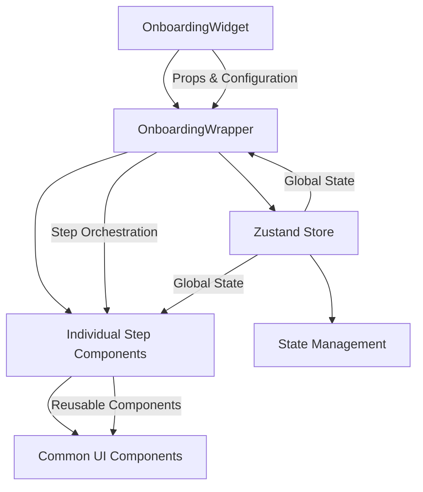
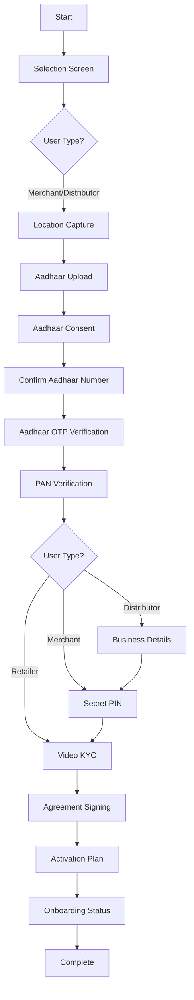
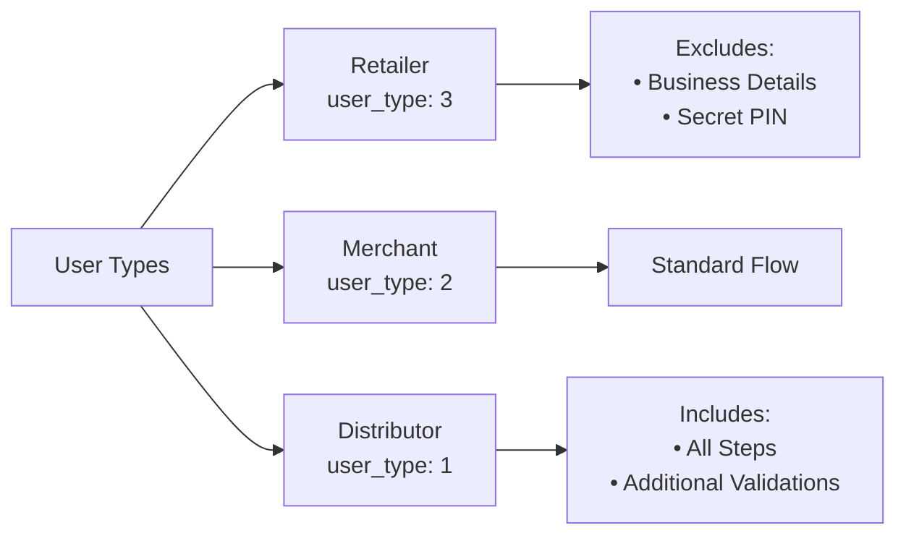

# Onboarding-as-a-Service (OaaS) Widget

[](https://www.npmjs.com/package/@ekoindia/oaas-widget)
[](https://github.com/ekoindia/oaas-widget/blob/main/LICENSE)
[](https://www.typescriptlang.org/)

A comprehensive React-based widget for digital onboarding processes, providing step-by-step user verification including KYC, document verification, location capture, and compliance checks.

## 🚀 Quick Start

### Installation

```bash
npm install @ekoindia/oaas-widget
```

### Basic Usage

```typescript
import { OnboardingWidget } from '@ekoindia/oaas-widget';

const MyApp = () => {
    const handleSubmit = (stepData) => {
        console.log('Step completed:', stepData);
        // Handle step submission to your backend
    };

    const stepsData = [
        {
            id: 2,
            name: 'selection',
            label: 'Select Your Role',
            primaryCTAText: 'Continue',
            description: 'Choose your business type',
            isSkipable: false,
            isRequired: true,
            isVisible: true,
            stepStatus: 1,
            form_data: {
                /* step-specific data */
            }
        }
        // ... other steps
    ];

    return <OnboardingWidget defaultStep="2" handleSubmit={handleSubmit} userData={{ userDetails: { user_type: 1 } }} stepsData={stepsData} primaryColor="#007bff" isBranding={true} />;
};
```

## 📋 Table of Contents

1. [Architecture Overview](#-architecture-overview)
2. [User Flow](#-user-flow)
3. [Available Steps](#-available-steps)
4. [Integration Guide](#-integration-guide)
5. [API Integration](#-api-integration)
6. [Configuration](#-configuration)
7. [Development Setup](#-development-setup)
8. [Project Structure](#-project-structure)
9. [Build & Deployment](#-build--deployment)

## 🏗️ Architecture Overview

The widget follows a modular architecture with the following key layers:



### Core Components

| Component             | Location                                  | Purpose                                           |
| --------------------- | ----------------------------------------- | ------------------------------------------------- |
| **OnboardingWidget**  | `src/components/OnboardingWidget/`        | Main container, handles configuration and theming |
| **OnboardingWrapper** | `src/components/Steps/OnboardingWrapper/` | Step orchestrator, manages flow and navigation    |
| **Individual Steps**  | `src/components/Steps/*/`                 | Step-specific implementations                     |
| **Common Components** | `src/components/Common/`                  | Reusable UI components                            |
| **Zustand Store**     | `src/store/zustand.tsx`                   | Global state management                           |

## 🔄 User Flow

### Complete Onboarding Flow



### User Type Variations



## 📝 Available Steps

### Core Verification Steps

| Step ID | Component                    | Purpose                   | Required | User Type Dependent    |
| ------- | ---------------------------- | ------------------------- | -------- | ---------------------- |
| 2       | `SelectionScreen`            | Role selection            | ✅       | All                    |
| 3       | `LocationCapture`            | GPS coordinates           | ✅       | All                    |
| 4-7     | `Aadhaar*`                   | Aadhaar verification flow | ✅       | All                    |
| 8       | `PanVerification`            | PAN card verification     | ✅       | All                    |
| 9       | `Business`                   | Business information      | ✅       | Distributors/Merchants |
| 10      | `SecretPin`                  | Security PIN setup        | ✅       | Distributors/Merchants |
| 11      | `VideoKYC`                   | Live video verification   | ✅       | All                    |
| 12      | `SignAgreement`              | Digital signature         | ✅       | All                    |
| 13      | `ActivationPlan`             | Service plan selection    | ✅       | All                    |
| 14      | `OnboardingStatus`           | Completion status         | ✅       | All                    |
| 15      | `PanAdharMatch`              | PAN-Aadhaar linkage       | ✅       | All                    |
| 16      | `PanVerificationDistributor` | Distributor PAN           | ✅       | Distributors           |
| 20      | `DigilockerRedirection`      | Digilocker integration    | ⚪       | Optional               |

### Step Status Values

-   **0 (Pending)**: Step not yet started
-   **1 (Active)**: Currently active step
-   **2 (Skipped)**: Step was skipped
-   **3 (Completed)**: Step successfully completed

## 🔧 Integration Guide

### Props Configuration

```typescript
interface OnboardingWidgetProps {
    defaultStep: string; // Starting step ID
    handleSubmit: (data: any) => void; // Step completion callback
    userData: {
        // User information
        userDetails: {
            user_type: 1 | 2 | 3; // 1: Distributor, 2: Merchant, 3: Retailer
            // ... other user details
        };
    };
    stepsData: StepDataType[]; // Step configuration array
    handleStepCallBack?: (params: {
        // Step-specific callback
        type: number;
        method: string;
        data?: any;
    }) => void;
    primaryColor?: string; // Theme color (default: #007bff)
    isBranding?: boolean; // Show/hide branding
    shopTypes?: Array<any>; // Available shop types
    stateTypes?: Array<any>; // Available states
    stepResponse?: any; // API response data
    selectedMerchantType?: any; // Merchant type selection
    esignStatus?: number; // E-signature status
    orgDetail?: any; // Organization details
    digilockerData?: any; // Digilocker integration data
}
```

### Step Data Structure

```typescript
type StepDataType = {
    id: number; // Unique step identifier
    name: string; // Step name/slug
    label: string; // Display title
    primaryCTAText: string; // Button text
    description: string; // Step description
    isSkipable: boolean; // Can be skipped
    isRequired: boolean; // Required for completion
    isVisible: boolean; // Should be shown in UI
    stepStatus: 0 | 1 | 2 | 3; // Step status
    role?: number; // Associated user role
    form_data: any; // Step-specific data
    success_message?: string; // Success message
};
```

## 🔌 API Integration

### Step Callbacks

```typescript
const handleStepCallBack = ({ type, method, data }) => {
    switch (`${type}-${method}`) {
        case '20-getDigilockerUrl':
            // Get Digilocker redirection URL
            return fetch('/api/digilocker/generate-url', {
                method: 'POST',
                body: JSON.stringify({ userId, sessionId }),
                headers: { 'Content-Type': 'application/json' }
            }).then((response) => response.json());

        case '7-verifyOtp':
            // Verify Aadhaar OTP
            return fetch('/api/aadhaar/verify-otp', {
                method: 'POST',
                body: JSON.stringify(data),
                headers: { 'Content-Type': 'application/json' }
            }).then((response) => response.json());

        case '12-esignDocument':
            // Handle e-signature
            return fetch('/api/esign/initiate', {
                method: 'POST',
                body: JSON.stringify(data),
                headers: { 'Content-Type': 'application/json' }
            }).then((response) => response.json());
    }
};
```

### Step Submission

```typescript
const handleSubmit = async (stepData) => {
    try {
        const response = await fetch('/api/onboarding/step', {
            method: 'POST',
            headers: { 'Content-Type': 'application/json' },
            body: JSON.stringify({
                stepId: stepData.id,
                formData: stepData.form_data,
                status: stepData.stepStatus
            })
        });

        const result = await response.json();

        if (result.status === 0) {
            // Success - widget will auto-progress
            setStepResponse(result);
        } else {
            // Handle validation errors
            setStepResponse({
                status: 1,
                invalid_params: result.errors
            });
        }
    } catch (error) {
        console.error('Step submission failed:', error);
    }
};
```

## ⚙️ Configuration

### Environment Setup

Create a `.env` file in your project root:

```bash
# API Configuration
REACT_APP_API_BASE_URL=https://your-api-base-url.com
REACT_APP_ENVIRONMENT=development

# Feature Flags
REACT_APP_ENABLE_DIGILOCKER=true
REACT_APP_ENABLE_VIDEO_KYC=true

# Third-party Integrations
REACT_APP_ESIGN_PROVIDER_URL=https://esign-provider.com
```

### Theming

```typescript
// Custom theme configuration
<OnboardingWidget
    primaryColor="#ff6b35" // Primary color
    isBranding={false} // Hide header/branding
    // CSS custom property --color-primary will be set
/>
```

### Step Visibility Control

```typescript
const stepsData = [
    {
        id: 9,
        name: 'business',
        // ... other properties
        isVisible: userData.userType !== 3, // Hide for retailers
        role: 1 // Only for distributors
    }
];
```

## 🛠️ Development Setup

### Prerequisites

-   Node.js (v16+)
-   React (v18+)
-   TypeScript (v4.9+)

### Local Development

To include the package in your local project for testing, you can use the npm link command. This will create a symlink to the package in your project's node_modules directory, allowing you to import
it as a local dependency.

#### To test the package locally:

1. Create build using `npm run build` to create dist folder which will serve target projects.
2. Run the `npm link` command in this project's root directory to create a symlink.
3. Run the `npm link @ekoindia/oaas-widget` command in your target project's root directory to link this package.
    1. A folder called `@ekoindia` will be created in your target project's node_modules directory with a symlink to this package. You may delete that folder to remove the symlink.
4. Import the package in your project and use it as a local dependency.

## 📁 Project Structure

```
oaas-widget/
├── 📁 src/                          # Source code
│   ├── 📁 assets/                   # Static assets
│   │   ├── 📁 icons/               # SVG and PNG icons
│   │   ├── CloseIcon.tsx           # Close icon component
│   │   └── DropdownIcon.tsx        # Dropdown icon component
│   │
│   ├── 📁 components/              # React components
│   │   ├── 📁 Common/              # Reusable components
│   │   │   ├── 📁 Camera/          # Camera-related components
│   │   │   ├── 📁 Header/          # Header components
│   │   │   ├── 📁 Sidebar/         # Sidebar components
│   │   │   ├── 📁 CamDropzone/     # Camera dropzone
│   │   │   ├── Alert.tsx           # Alert component
│   │   │   ├── ButtonGlobal.tsx    # Global button component
│   │   │   ├── InputGlobal.tsx     # Global input component
│   │   │   ├── Modal.tsx           # Modal component
│   │   │   ├── Spinner.tsx         # Loading spinner
│   │   │   └── ...                 # Other common components
│   │   │
│   │   ├── 📁 CustomHooks/         # Custom React hooks
│   │   │   └── UseGeoLocation.tsx  # Geolocation hook
│   │   │
│   │   ├── 📁 OnboardingWidget/    # Main widget component
│   │   │   ├── OnboardingWidget.tsx
│   │   │   └── index.ts
│   │   │
│   │   └── 📁 Steps/               # Step components
│   │       ├── 📁 AadharSteps/     # Aadhaar verification steps
│   │       ├── 📁 ActivationPlan/  # Activation plan selection
│   │       ├── 📁 Agreement/       # Agreement signing
│   │       ├── 📁 Business/        # Business details
│   │       ├── 📁 DigilockerRedirection/ # Digilocker integration
│   │       ├── 📁 KYC/            # Video KYC
│   │       ├── 📁 Location/        # Location capture
│   │       ├── 📁 OnBoardingStatus/ # Onboarding status
│   │       ├── 📁 OnboardingWrapper/ # Step orchestrator
│   │       ├── 📁 PanSteps/        # PAN verification steps
│   │       ├── 📁 PIN/             # Secret PIN setup
│   │       ├── 📁 SelectionScreen/ # Role selection
│   │       ├── 📁 SupersetComponent/ # Superset integration
│   │       ├── 📁 Welcome/         # Welcome screen
│   │       └── index.ts
│   │
│   ├── 📁 scripts/                 # External scripts
│   │   └── leegalityv5.min.js     # Leegality integration
│   │
│   ├── 📁 store/                   # State management
│   │   └── zustand.tsx            # Zustand store configuration
│   │
│   ├── 📁 types/                   # TypeScript type definitions
│   │   └── index.d.ts             # Global type definitions
│   │
│   ├── 📁 utils/                   # Utility functions
│   │   ├── 📁 data/               # Data configurations
│   │   │   └── stepsData.ts       # Step data types
│   │   └── 📁 globalInterfaces/   # Global interfaces
│   │       └── stepsInterface.ts  # Step interface definitions
│   │
│   ├── index.css                  # Global styles
│   └── index.ts                   # Main entry point
│
├── 📁 types/                       # Generated TypeScript declarations
├── 📁 dist/                        # Built package output
├── package.json                    # Package configuration
├── tsconfig.json                   # TypeScript configuration
├── tailwind.config.js              # Tailwind CSS configuration
├── postcss.config.js               # PostCSS configuration
├── rollup.config.js                # Rollup build configuration
└── README.md                       # This documentation
```

### Key Directories Explained

| Directory                | Purpose                                                           |
| ------------------------ | ----------------------------------------------------------------- |
| `src/components/Steps/`  | Contains all step-specific components for the onboarding flow     |
| `src/components/Common/` | Reusable UI components used across different steps                |
| `src/store/`             | Zustand-based state management for global application state       |
| `src/utils/`             | Utility functions, data configurations, and interface definitions |
| `src/assets/`            | Static assets including icons and images                          |
| `types/`                 | Generated TypeScript declaration files for the built package      |

## 🚀 Build & Deployment

### Build Configuration

The project uses **Rollup** for efficient bundling with the following features:

-   **Tree Shaking**: Removes unused code for smaller bundle sizes
-   **ES Module Support**: Native ES module compatibility
-   **Multiple Output Formats**: UMD and ESM builds
-   **TypeScript Support**: Full TypeScript compilation and declaration generation
-   **CSS Processing**: PostCSS and Tailwind CSS integration

### Build Scripts

```bash
# Production build
npm run build

# Generates:
# ├── dist/
# │   ├── index.js          # UMD bundle
# │   ├── index.esm.js      # ES module bundle
# │   ├── index.d.ts        # TypeScript declarations
# │   └── styles/           # Processed CSS
```

### Publishing to NPM

1. Increment the package version in `package.json` file.
2. Build the package: `npm run build`
3. Add your npm credentials using `npm adduser` (app.admin account).
    1. Enter username, email and password.
    1. Enter OTP sent to app.admin's email.
4. Publish the package: `npm run publish-try`

### Configuration Files

#### TypeScript Configuration (`tsconfig.json`)

```json
{
    "compilerOptions": {
        "target": "ES6",
        "lib": ["ES2018", "DOM"],
        "jsx": "react",
        "module": "ESNext",
        "declaration": true,
        "declarationDir": "types",
        "outDir": "dist/esm",
        "strict": true,
        "moduleResolution": "node",
        "allowSyntheticDefaultImports": true,
        "esModuleInterop": true,
        "skipLibCheck": true
    },
    "include": ["src/**/*"],
    "exclude": ["node_modules", "dist"]
}
```

#### Rollup Configuration

-   **Input**: `src/index.ts`
-   **Output**: Multiple formats (UMD, ESM)
-   **Plugins**: TypeScript, PostCSS, Terser
-   **External**: React, React-DOM (peer dependencies)

#### Tailwind CSS Configuration

```javascript
module.exports = {
    content: ['src/**/*.{ts,tsx}'],
    theme: {
        extend: {
            colors: {
                primary: 'var(--color-primary, #007bff)'
                // ... custom color palette
            },
            boxShadow: {
                xl: '0 20px 25px -5px rgba(0, 0, 0, 0.1)'
                // ... custom shadows
            }
        },
        container: {
            center: true,
            padding: {
                DEFAULT: '1rem',
                sm: '2rem',
                lg: '4rem',
                xl: '5rem',
                '2xl': '6rem'
            }
        }
    }
};
```

## 🧪 Testing & Quality

### Testing Framework

-   **Jest**: Unit and integration testing
-   **React Testing Library**: Component testing
-   **TypeScript**: Static type checking

```bash
# Run tests
npm test

# Run tests with coverage
npm run test-coverage

# Watch mode
npm test -- --watch
```

### Storybook Integration

Interactive component development and documentation:

```bash
# Start Storybook development server
npm run storybook

# Build Storybook static site
npm run build-storybook
```

## 🔧 Advanced Features

### State Management with Zustand

```typescript
// Global state structure
interface OnboardingState {
    // Step Management
    steps: StepDataType[];
    currentStep: number;

    // UI State
    fetchData: boolean;
    sideBarToggle: boolean;

    // Media & Camera
    image: any | null;
    cameraType: string;
    cameraStatus: boolean;

    // Verification Status
    panStatus: number;
    esignStatus: number;

    // Actions
    setCurrentStep: (step: number) => void;
    setStepsData: (data: StepDataType) => void;
    // ... other actions
}
```

### Custom Hooks

#### useGeoLocation

```typescript
const { location, error, loading } = useGeoLocation();
```

### Error Handling

```typescript
const handleSubmit = async (stepData) => {
    try {
        const response = await apiCall('/onboarding/step', stepData);

        if (response.status === 0) {
            // Success
            proceedToNextStep(response);
        } else {
            // Validation errors
            showErrors(response.invalid_params);
        }
    } catch (error) {
        // Network/system errors
        showErrorMessage('Something went wrong. Please try again.');
    }
};
```

## 🌐 Browser Support

| Browser | Version |
| ------- | ------- |
| Chrome  | ≥ 60    |
| Firefox | ≥ 60    |
| Safari  | ≥ 12    |
| Edge    | ≥ 79    |

## 📱 Mobile Support

-   **Responsive Design**: Mobile-first approach
-   **Touch Interactions**: Optimized for touch devices
-   **Camera Access**: Native camera integration
-   **Geolocation**: GPS coordinate capture
-   **Progressive Web App**: PWA-ready

## 🔒 Security Features

-   **HTTPS Required**: For camera and location access
-   **Data Encryption**: Secure data transmission
-   **Input Validation**: Client and server-side validation
-   **CSP Headers**: Content Security Policy support
-   **GDPR Compliance**: Privacy regulation compliance

## 🚨 Troubleshooting

### Common Issues

#### Camera Not Working

```bash
# Check browser permissions
# Ensure HTTPS is enabled
# Verify camera access in browser settings
```

#### Location Not Captured

```bash
# Check geolocation permissions
# Ensure HTTPS is enabled
# Verify location services are enabled
```

#### Step Not Progressing

```bash
# Check stepResponse prop format
# Verify API response structure
# Check browser console for errors
```

#### Build Errors

```bash
# Clear node_modules and reinstall
rm -rf node_modules package-lock.json
npm install

# Clear build cache
rm -rf dist
npm run build
```

## 📞 Support

-   **Documentation**: [README.md](./README.md)
-   **NPM Package**: [@ekoindia/oaas-widget](https://www.npmjs.com/package/@ekoindia/oaas-widget)
-   **Issues**: [GitHub Issues](https://github.com/ekoindia/oaas-widget/issues)
-   **License**: MIT

## 🤝 Contributing

1. Fork the repository
2. Create a feature branch
3. Make your changes
4. Add tests for new features
5. Run the test suite
6. Submit a pull request

---

**Made with ❤️ by [Eko India Financial Services](https://www.eko.in)**
